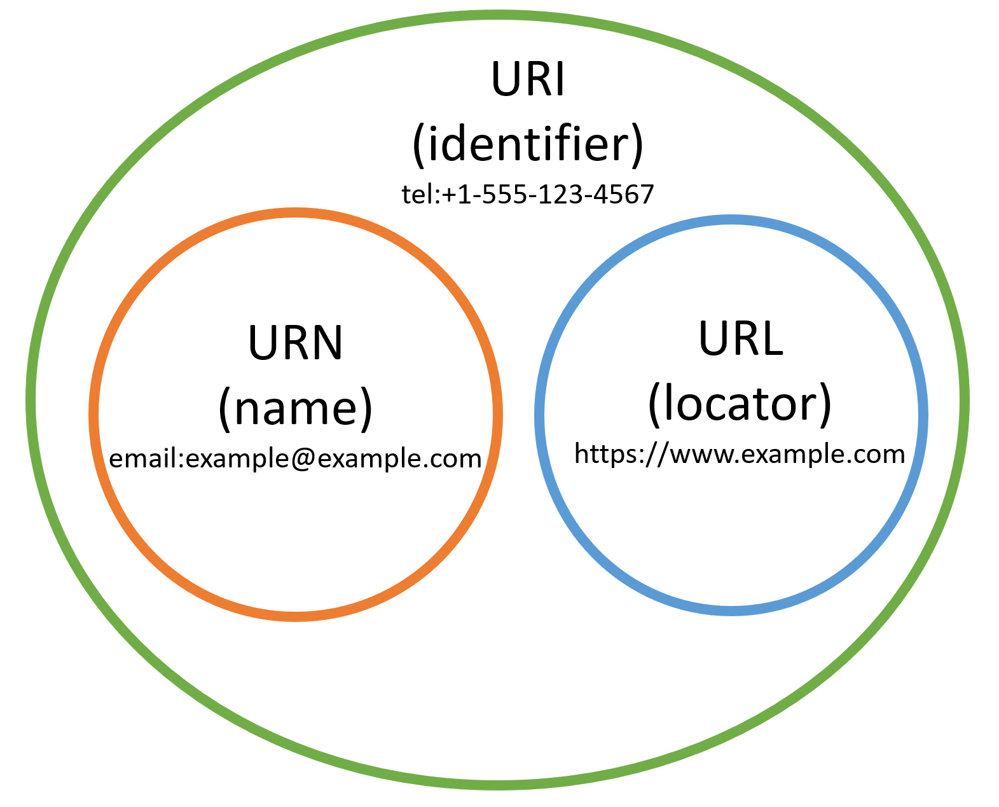

# RESTful API Fundamentals

**RESTful API** stands for "Representational State Transfer Application Programming Interface." A RESTful API is a type of web service that adheres to the principles and constraints of REST (Representational State Transfer), which is an architectural style for designing networked applications. RESTful APIs enable communication between software systems over the internet, making it possible for different applications to interact with each other by sending and receiving data via standard HTTP methods.

## Key Concepts

- **Resources**: In a RESTful API, everything is treated as a resource, which can be an object, data, or entity. Resources are uniquely identified by Uniform Resource Identifiers (URIs). Examples of resources in an e-commerce system might include products, orders, and customers.
- **Uniform Resource Identifiers (URIs)**: URIs are used to identify and locate resources within the API. Each resource is associated with a URI, making it accessible via a specific URL. For example, a product resource might have a URI like `https://api.example.com/products/123`.
- **HTTP Methods**: Standard HTTP methods are used to perform actions on resources:
  - GET: Retrieve data from a resource.
  - POST: Create a new resource.
  - PUT: Update an existing resource or create it if it doesn't exist.
  - DELETE: Remove a resource.
- **Stateless Communication**: RESTful communication is stateless, which means that each client-server interaction is independent. The server doesn't store any information about the client's state between requests. This statelessness simplifies communication, promotes scalability, and ensures reliability.
- **Representations**: Resources can have multiple representations, such as JSON, XML, HTML, or other formats. Clients can specify the desired representation format when making requests. For example, a client might request product data in JSON format.
- **Uniform Interface**: RESTful APIs provide a uniform and consistent interface for communication. This is achieved through the use of standard HTTP methods and well-defined URIs. The uniform interface simplifies interactions and makes the API more predictable.
- **Client-Server Architecture**: REST follows a client-server architectural style, where the client and server are separate entities. The client is responsible for the user interface and user experience, while the server manages resources and processes requests. This separation of concerns supports scalability and allows each component to evolve independently.

## URI vs URL

- **URI (Uniform Resource Identifier)** is a generic term used to identify any resource, either online or offline, by name or location. It's a string of characters that serves as a compact and convenient way to uniquely identify a resource. URIs can be further classified into two subcategories: URLs and URNs.
- **URL (Uniform Resource Locator)** is a specific type of URI that not only identifies a resource but also provides the means to locate or access it. URLs include both the resource's identifier and the information needed to access it, such as the protocol (e.g., HTTP), domain name, path, and, if necessary, query parameters and fragment identifiers.
- **URN (Uniform Resource Name)** is a type of URI that identifies a resource by name in a particular namespace, providing a globally unique identifier.

URLs are commonly used to specify the location of web resources on the internet. For example, `https://www.example.com/index.html` is a URL that identifies the resource (index.html) and provides the protocol (HTTP) and domain (`www.example.com`) to access it.

```graphql
https://www.example.com/index.html
urn:email:example@example.com
```
URLs are commonly used to specify the location of web resources on the internet. For example, "https://www.example.com/index.html" is a URL that identifies the resource (index.html) and provides the protocol (HTTP) and domain (www.example.com) to access it.

