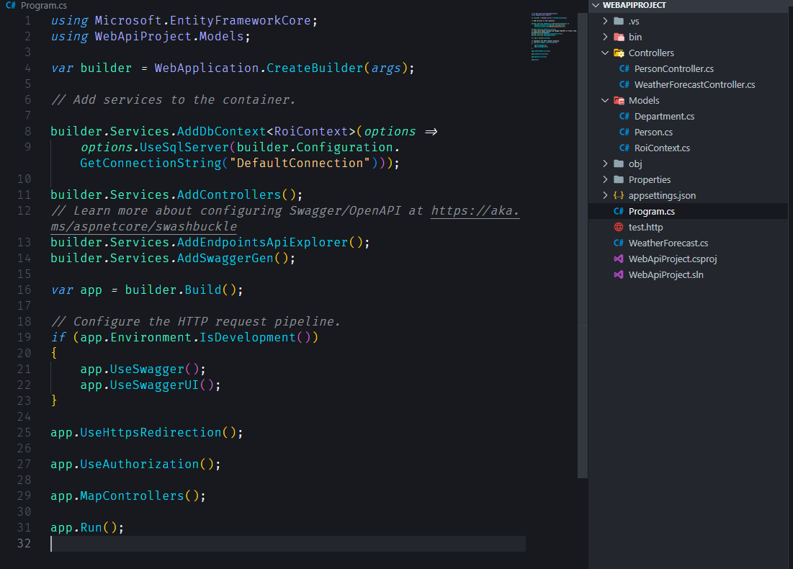
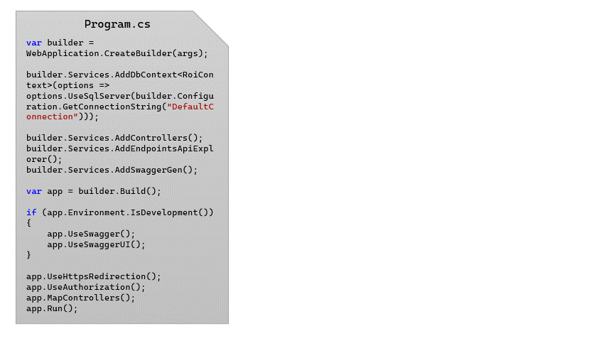
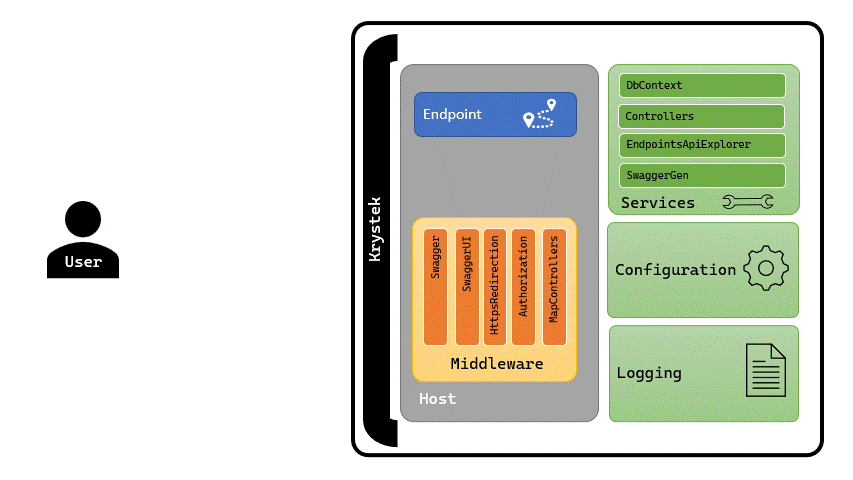
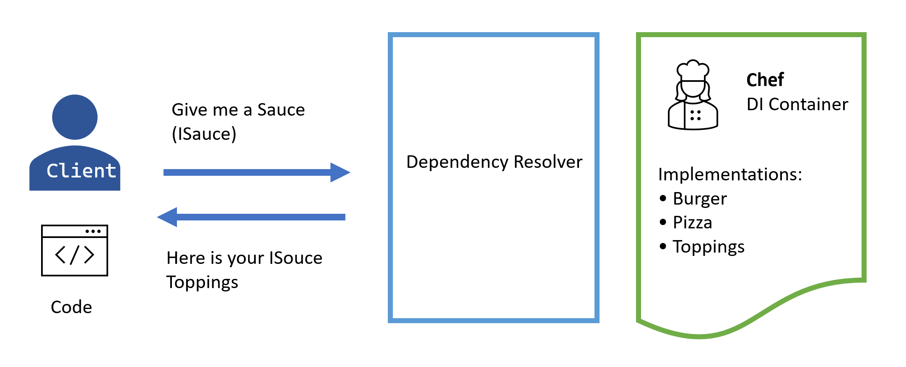

# Anatomy of the Project

## Create a project

Create a console project

```bash
dotnet new console -n EFCoreConsoleApp --use-program-main
```

Create a web api project

```bash
dotnet new webapi -n WebApiProject
```

- `-minimal`: to use minimal APIs instead of controllers
- `--use-program-main` : to generate an explicit Program class and Main method instead of top-level statements.

## Adding packages

To add Entity Framework Core and Entity Framework Core Tools packages, run the following commands:

```bash
dotnet add package Microsoft.EntityFrameworkCore
dotnet add package Microsoft.EntityFrameworkCore.Design
dotnet add package Microsoft.EntityFrameworkCore.SqlServer
dotnet add package Microsoft.EntityFrameworkCore.Tools
dotnet add package Microsoft.VisualStudio.Web.CodeGeneration.Design
dotnet add package AutoMapper.Extensions.Microsoft.DependencyInjection
```

## Project Structure

Common project components

- **Controllers** (endpoints for handling HTTP requests).
- **Models** (data models for your API).
- **Program.cs** (the entry point of the application).
- **appsettings.json** configuration file



## How the Host Starts



## Request and Response Flow



### Dependency Injection

the pizza analogy to better reflect the terminology commonly used in Dependency Injection (DI) principles. In this case

- **Pizza Crust** (Application Core): This still represents your application's core logic.
- **Sauce** (Service Interface): The sauce can represent the service interface, which defines the contract for the services that your application depends on.
- **Toppings** (Service Implementations): The toppings can represent the actual service implementations that adhere to the service interface (the sauce).
- **Chef** (DI Container): The DI container acts like the chef, assembling the pizza by placing the sauce (interface) and toppings (implementations) on the crust (application core).

The flow of how your application asks for a service (sauce) and how the chef (DI container) adds the toppings (service implementations):

- **Client's Request**: The application (client) needs a specific service, just like a person ordering a pizza.
- **Service Selection**: The client looks at the menu (sauce) to find the service they need. They identify the service by its name (the **service interface**).
- **Order Placement**: The client places an order by specifying the service name (**service interface**) from the menu (sauce).
- **Chef's Action**: The chef (**DI container**) receives the order and knows exactly which topping (**service implementation**) to add based on the service name (service interface).
- **Service Delivery**: The chef adds the chosen topping (**service implementation**) to the pizza (application core) to fulfill the client's request.
- **Client's Utilization**: The client can now use the added topping (service implementation) to enhance or complete its order (application functionality).


