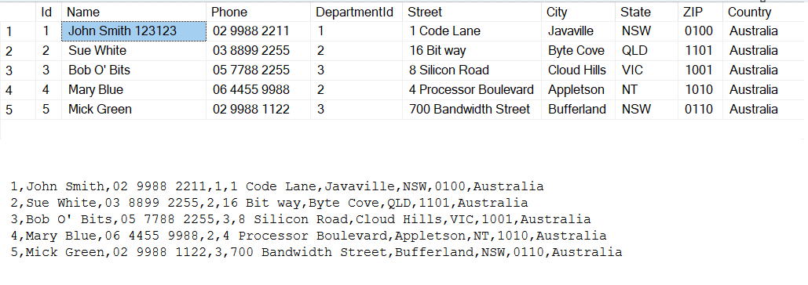
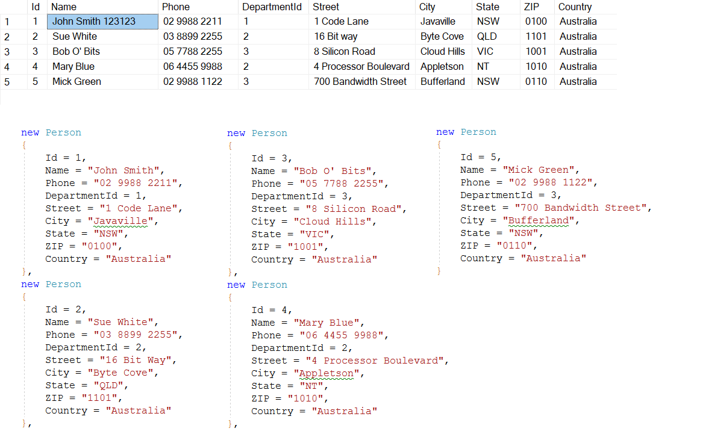

# ORM (Object-Relational Mapping)

Object-Relational Mapping (ORM) is a programming technique and software design pattern that allows developers to interact with relational databases using object-oriented programming languages. ORM bridges the gap between the object-oriented world of code and the relational world of databases by providing a high-level, object-oriented API for database operations. It simplifies database access and management by allowing developers to work with objects and classes, rather than writing raw SQL queries.

## Key Concepts

**Object-Relational Mapping**: ORM maps database tables to classes, database records to objects, and database columns to object properties. This mapping is defined using configuration or annotations.

**Entities**: Entities represent data objects in the database. Each entity class corresponds to a table in the database, and instances of the class represent individual rows or records in that table.

**Persistence**: ORM tools provide mechanisms for saving (inserting or updating) objects into the database and retrieving objects from the database.

**Query Language**: ORM frameworks often include a query language or methods for querying the database using object-oriented syntax, reducing the need to write raw SQL.

**Relationships**: ORM supports defining and managing relationships between entities, such as one-to-many, many-to-one, and many-to-many associations.

**Lazy Loading**: ORM systems often offer lazy loading, a technique where related data is loaded from the database only when it's accessed in code, improving performance.

## Available ORM Frameworks

There are several ORM frameworks available for different programming languages. Some popular ones include:

**Entity Framework (EF)**: Entity Framework is a popular ORM framework for .NET. It supports multiple database providers and simplifies database operations using LINQ (Language-Integrated Query).

**Hibernate**: Hibernate is a widely-used ORM framework for Java applications. It supports Java Persistence API (JPA) and simplifies database interaction.

**Django ORM**: Django ORM is the built-in ORM framework for Django, a Python web framework. It provides a high-level, Pythonic way to work with databases.

**Sequelize**: Sequelize is an ORM for Node.js applications, providing support for multiple databases. It uses JavaScript and Promises for database operations.

**SQLAlchemy**: SQLAlchemy is a popular Python ORM that offers both high-level ORM and low-level SQL expression capabilities. It can be used in a wide range of applications.

## Read Data without ORM

## Read Data with ORM

