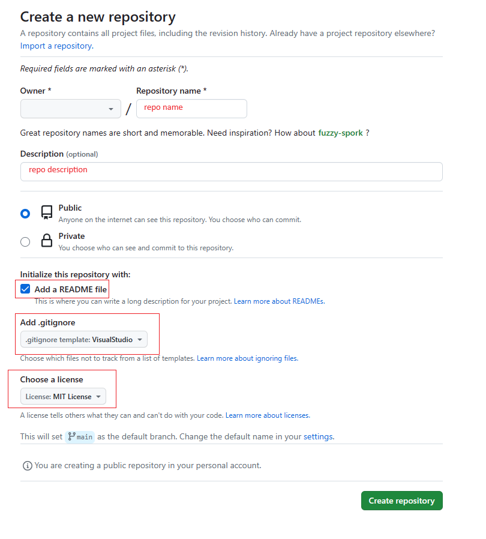
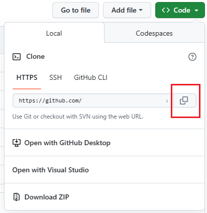

# Api Project

- [Api Project](#api-project)
  - [I. Git repo](#i-git-repo)
    - [II. Create database](#ii-create-database)
  - [III. ASP.NET Core Web API](#iii-aspnet-core-web-api)
    - [Create a New ASP.NET Core Web API Project](#create-a-new-aspnet-core-web-api-project)
    - [Add NuGet Packages](#add-nuget-packages)
    - [Scaffolding](#scaffolding)

## I. Git repo

- **1. Install Git on Windows**: You can download the latest [Git for Windows](https://gitforwindows.org/) installer and follow the instructions as provided in the Git Setup wizard screen until the installation is complete.
- **2. Configure Git on Windows**: You need to set up your name and email address for Git to identify you as the author of your commits.

```bash
git config --global user.name "Your Name"
git config --global user.email "your.email@example.com"
```

- **3. Create a repository on github**
  - Login to your account on github
  - Create a new repository
    - Name the repo
    - Add description
    - Set as public
    - Add README file
    - Add .gitignore
    - Choose a license



- **4. Clone the repository**
  - Clone it to your local machine by typing the following command in the **command prompt**
  - Visit the repo page
    - Click on the green button **Code**
    - Select local tab
    - Select HTTPS
    - Click on the copy button to copy the link of your repo



- Open command prompt:

```bash
cd c:\
mkdir project
cd c:\project
git clone <past the repo link from clipboard>
# you should have
git clone https://github.com/username/repository.git
# You may need to add repository to safe dir in git config
git config --global --add safe.directory 'c:/project/repository'
# Change directory to repository dir
cd repository
# Start vscode
code .
```

- **5. Push to remote repo**

Stage your changes for commit by typing the following command:

```bash
git add .
```

This will add all the modified files to the staging area
Commit your changes with a message by typing the following command:

```bash
git commit -m "Your commit message"
```

Push your changes to the remote repository by typing the following command:

```bash
git push
```

> When you clone a repository from GitHub using HTTPS, Git will typically prompt you for your GitHub username and password when you try to push changes to the remote repository.

### II. Create database

- `(LocalDb)\MSSQLLocalDB`
- Use plural nouns for table names.
- Use singular nouns for class names representing entities
- Use plural nouns for endpoint routes.
- Use PascalCase for class names, and controller class names.
- Use `roi_database.sql` to create your database

## III. ASP.NET Core Web API

### Create a New ASP.NET Core Web API Project

- Open the terminal in vscode.
- Run the following command to create a new ASP.NET Core Web API project:

```bash
dotnet new webapi
```

### Add NuGet Packages

To use Entity Framework Core in your project, run the following commands to add necessary NuGet packages:

```bash
dotnet add package Microsoft.EntityFrameworkCore
dotnet add package Microsoft.EntityFrameworkCore.Design
dotnet add package Microsoft.EntityFrameworkCore.SqlServer
dotnet add package Microsoft.EntityFrameworkCore.Tools
dotnet add package Microsoft.VisualStudio.Web.CodeGeneration.Design
dotnet add package AutoMapper.Extensions.Microsoft.DependencyInjection
```

### Scaffolding

1. Make sure you have installed `dotnet-ef` and `dotnet-aspnet-codegenerator`

```bash
dotnet tool install --global dotnet-ef
dotnet tool install -g dotnet-aspnet-codegenerator
```

2. Run the following command

```bash
dotnet ef dbcontext scaffold "Server=(localdb)\MSSQLLocalDB;Database=roi_database;Trusted_Connection=True;" Microsoft.EntityFrameworkCore.SqlServer -o Models
```

3. Remove database connection comment from `RoiDatabaseContext` class in `OnConfiguring` method

```csharp
    protected override void OnConfiguring(DbContextOptionsBuilder optionsBuilder)
    {}
```

4. Add `System.Text.Json.Serialization.JsonIgnore` to `ICollection<Person> People` in `Department` class

```csharp
    [System.Text.Json.Serialization.JsonIgnore]
    public virtual ICollection<Person> People { get; set; } = new List<Person>();
```

5. Update `appsettings.json`, by adding the `ConnectionStrings`

```json
{
  "ConnectionStrings": {
    "DefaultConnection": "Server=(localdb)\\MSSQLLocalDB;Database=roi_database;Trusted_Connection=True;"
  },
  "Logging": {
    "LogLevel": {
      "Default": "Information",
      "Microsoft.AspNetCore": "Warning"
    }
  },
  "AllowedHosts": "*"
}
```

6. Add `DbContext` to the services of the app in `Program.cs`

```csharp
// After Add services to the container.
builder.Services.AddDbContext<RoiDatabaseContext>(options =>
    options.UseSqlServer(builder.Configuration.GetConnectionString("DefaultConnection")));
```

7. Setup CORS: In `program.cs` file add the following code

```csharp
// Add after RoiDatabaseContext Service configuration

// Define CORS policies to allow access to our API
builder.Services.AddCors(options => {

    // Build a default CORS policy
    options.AddDefaultPolicy(policy => {

        // Allow ANY origin to access our API
        policy.AllowAnyOrigin();

        // Allow SPECIFIC origins to access our API
        //policy.WithOrigins("http://localhost:19006", "https://app.roi.com.au");

        // Allow any HTTP header
        policy.AllowAnyHeader();

        // Allow any HTTP method
        policy.AllowAnyMethod();

    });
});

// Add between app.UseHttpsRedirection();  and app.UseAuthorization();

// Enable CORS (default policy)
app.UseCors();
```

8. Scaffold API Controllers

> Note: change **test.Models** with your application' name space

```bash
dotnet aspnet-codegenerator controller -name PeopleController -m test.Models.Person -dc test.Models.RoiDatabaseContext --relativeFolderPath Controllers --useDefaultLayout --referenceScriptLibraries -api
```

```bash
dotnet aspnet-codegenerator controller -name DepartmentsController -m test.Models.Department -dc test.Models.RoiDatabaseContext --relativeFolderPath Controllers --useDefaultLayout --referenceScriptLibraries -api
```

8. Update Controllers

Update `GetPeople` method in `PeopleController` with the following:

```csharp
return await _context.People.Include("Department").ToListAsync();
```

Update `GetPerson` method in `PeopleController` with the following:

```csharp
var person = await _context.People.Include(p => p.Department).FirstOrDefaultAsync(p => p.Id == id);
```

10. Build and Run

```bash
dotnet run
```

11. Test

Use REST Client extension in Visual Studio Code with the `test.http` file, change hostname and port to your app
