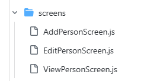
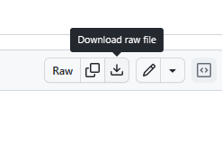
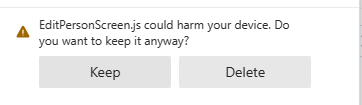
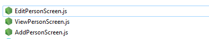
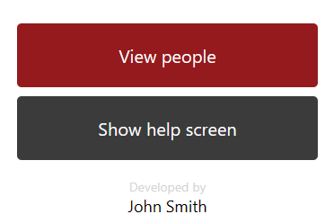

# Guide to Completing Your Mobile Project

## Update files and styles

- Install the following package

```bash
npx expo install react-native-flash-message
```


- Copy files form folders `components`, `constants`, `styles`, and `App.js` and `jsconfig.json`
- download 3 screen template from [screen](https://github.com/Jalal-Alhaddad/Guide-to-Building-RESTful-APIs-in-ASP.NET-Core/tree/main/4.%20Project/screens)



- Click on each file, then download usng the download raw file icon



- If have the following message, press keep and continue



- You should have 3 files in Download folder, copy it to screen folder in your project



## Update Home Screen

- Add the following code to the beginning of the home screen file

```javascript
import { Image, Pressable } from 'react-native';
import { imageIndex } from '../constants/images.js';
```

- Add the following code to the beginning of the home screen component

```javascript
const [isLogoColor, setIsLogoColor] = React.useState(true);

function toggleLogo() {
  setIsLogoColor(!isLogoColor);
}

function showViewPeople() {
  props.navigation.replace('Root', { screen: 'People' });
}

function showHelp() {
  props.navigation.replace('Root', { screen: 'Help' });
}
```

- Add the following jsx to the home screen

```jsx
<SafeAreaView style={Styles.safeAreaView}>
  <ScrollView style={Styles.container} contentContainerStyle={Styles.contentContainer}>
    <View style={Styles.homeLogoContainer}>
      <Pressable onPress={toggleLogo}>
        <Image source={imageIndex[isLogoColor ? 'logo' : 'mono']} style={Styles.homeLogo} />
      </Pressable>
    </View>

    {/* <MyImage index="logo" /> */}

    <View style={Styles.homeHeadingContainer}>
      <Text style={Styles.homeHeading}>ROI HR Management System</Text>
    </View>

    <View style={Styles.homeButtonContainer}>
      <MyButton
        text="View people"
        type="major" // default*|major|minor
        size="large" // small|medium*|large
        onPress={showViewPeople}
        buttonStyle={Styles.homeButton}
      />
      <MyButton
        text="Show help screen"
        type="default" // default*|major|minor
        size="large" // small|medium*|large
        onPress={showHelp}
        buttonStyle={Styles.homeButton}
      />
    </View>
  </ScrollView>
</SafeAreaView>
```

- Customize home screen with your name, add the following jsx after the button container

```jsx
<View style={{ flexDirection: 'column', justifyContent: 'center', alignItems: 'center', marginTop: 20 }}>
  <Text style={{ color: 'lightgray', fontSize: 14 }}>Developed by</Text>
  <Text style={{ fontSize: 18 }}>John Smith</Text>
</View>
```

- You can have vertical aligned buttons



Change in MainStyle

```json
  homeButtonContainer: {
    flexDirection: 'column', //row
    justifyContent: 'center',
  },
  homeButton: {
    flex: 1,
    marginTop: 10,
    marginHorizontal: 10,
    paddingHorizontal: 10,
    // marginVertical: 10,
  },
```

## Update Help Screen

- Add at the top of the file

```javascript
import { MyButton } from '../components/MyButton';
```

- Add the beginning of the component

```javascript
// State management

const [fontSizeModifier, setFontSizeModifier] = React.useState(Settings.fontSizeModifier);

// changeFontSize(-0.1)
function changeFontSize(sizeModifier) {
  // TODO: validate the font size (e.g. not negative)

  // Update the global settings value
  Settings.fontSizeModifier += sizeModifier;

  // Update the state variable to re-render the screen (update the UI)
  setFontSizeModifier(Settings.fontSizeModifier);
}
```

- Add after Help topic text component

```jsx
    <TextH3>Font size</TextH3>

    <View style={Styles.helpButtonContainer}>
      <MyButton
        text="- Smaller"
        type="default" // default*|major|minor
        size="medium" // small|medium*|large
        onPress={()=>{changeFontSize(-0.1)}}
        buttonStyle={Styles.helpButton}
      />
      <MyButton
        text="+ Bigger"
        type="default" // default*|major|minor
        size="medium" // small|medium*|large
        onPress={()=>{changeFontSize(+0.1)}}
        buttonStyle={Styles.helpButton}
      />
    </View>
```

## Update ViewPeople Screen

- Update import

```javascript
import { RoiDeletePerson, RoiGetPeople } from '../utils/RoiApi';
import { PopupOk, PopupOkCancel } from '../utils/Popup';
import { ButtonContainer } from '../components/ButtonContainer';
import NetInfo from '@react-native-community/netinfo';
```

- Delete `function showAddPerson()`
- Add the following after `refreshPersonList` function

```javascript
function showAddPerson() {
  // Navigate to AddPerson and replace the current screen
  props.navigation.replace('Root', { screen: 'AddPerson' });
}

function showViewPerson(person) {
  // Navigate to ViewPerson and pass through the person's ID as a param
  props.navigation.navigate('ViewPerson', { id: person.id });
}

function showEditPerson(person) {
  // Navigate to EditPerson and pass through the person's ID as a param
  props.navigation.navigate('EditPerson', { id: person.id });
}

/**
 * Delete a person from the database
 * @param {Person} person The person to delete.
 */
function deletePerson(person) {
  // Check if person should be deleted (confirm with user)
  PopupOkCancel(
    // Title and message
    'Delete person?',
    `Are you sure you want to delete ${person.name}`,

    // 0K - delete the person
    () => {
      // Delete the person using the API
      RoiDeletePerson(person.id)
        .then((data) => {
          // Show confirmation that the person has been deleted
          PopupOk('Person deleted', `${person.name} has been  deleted`);
          // Refresh the person list
          refreshPersonList();
        })
        .catch((error) => {
          // Display error
          PopupOk('API Error', 'Could not delete person');
        });
      // console.log('Ok.. deleting person');
    },
    // Cancel do nothing
    () => {
      console.log('Cancel - no delete for you!');
    }
  );
}

// Display flash message banner if offline
function displayConnectionMessage() {
  console.log('displayConnectionMessage');
  // Get network connection status
  NetInfo.fetch().then((status) => {
    // Check if not connected to the Internet
    if (!status.isConnected) {
      // Display the flash message
      infoMessage('No internet connection', 'You will only see cached data until you \nhave an active internet connection again');
    }
  });
}
```

- Replace `displayPeople`

```javascript
// Display all people data
function displayPeople() {
  // Display flash message when there's a connection issue
  displayConnectionMessage();

  // Cancel if no people to display
  if (!people) return;

  // Loop through each item and turn into appropriate output and then return the result
  return people.map((p) => {
    // Create an output view for each item
    return (
      <View key={p.id} style={Styles.dataContainerHorizontal}>
        <View style={Styles.personListItemDetails}>
          <TextParagraph style={Styles.personListItemName}>{p.name}</TextParagraph>
          <TextParagraph style={Styles.personListItemText}>{p.department?.name ?? '---'}</TextParagraph>
          <TextParagraph style={Styles.personListItemText}>{p.phone}</TextParagraph>
        </View>
        <ButtonContainer direction="column">
          {/* <View style={Styles.personListItemButtons}> */}
          <MyButton
            text="info"
            type="major" // default*|major|minor
            size="small" // small|medium*|large
            onPress={() => {
              showViewPerson(p);
            }}
            buttonStyle={Styles.personListItemButton}
            textStyle={Styles.personListItemButtonText}
          />
          <MyButton
            text="Edit"
            type="default" // default*|major|minor
            size="small" // small|medium*|large
            onPress={() => {
              showEditPerson(p);
            }}
            buttonStyle={Styles.personListItemButton}
            textStyle={Styles.personListItemButtonText}
          />
          <MyButton
            text="Delete"
            type="minor" // default*|major|minor
            size="small" // small|medium*|large
            onPress={() => deletePerson(p)}
            buttonStyle={Styles.personListItemButton}
            textStyle={Styles.personListItemButtonText}
          />
          {/* </View> */}
        </ButtonContainer>
      </View>
    );
  });
}
```

## ViewPersonScreen

- Update `PeopleNavigator.js`
- Add import lines

```javascript
import ViewPersonScreen from '../screens/ViewPersonScreen';
import EditPersonScreen from '../screens/EditPersonScreen';
```

- Replace `PeopleNavigator` function

```javascript
export default function PeopleNavigator() {
  return (
    <Stack.Navigator
      initialRouteName="ViewPeople"
      screenOptions={{
        headerShown: true,
        headerBackTitle: 'Back',
        headerStyle: Styles.headerBar,
        headerTitleStyle: Styles.headerBarTitle,
      }}
    >
      <Stack.Screen name="ViewPeople" component={ViewPeopleScreen} options={{ title: 'View All People' }} />
      <Stack.Screen name="ViewPerson" component={ViewPersonScreen} options={{ title: 'View Person' }} />
      <Stack.Screen name="EditPerson" component={EditPersonScreen} options={{ title: 'Edit Person' }} />
    </Stack.Navigator>
  );
}
```

- Update `ViewPersonScreen.js` from screens folder, the return part of the component

> **You need to complete this screen yourself, read carefully and complete the remaining fields**

```javascript
// Main output of the screen component
return (
  <SafeAreaView style={Styles.safeAreaView}>
    <ScrollView style={Styles.container} contentContainerStyle={Styles.contentContainer}>
      <TextH1 style={{ marginTop: 0 }}>Person: {person.name}</TextH1>

      <View style={Styles.form}>
        <View style={Styles.fieldSet}>
          <TextParagraph style={Styles.legend}>Details</TextParagraph>

          {/* Add Name, Phone here */}

          <View style={Styles.formRow}>
            <TextLabel>Department:</TextLabel>
            <TextParagraph>{person.department ? person.department.name : '---'}</TextParagraph>
            {/* <TextParagraph>{person.department?.name ?? '<NONE>'}</TextParagraph> */}
          </View>
        </View>

        <View style={Styles.fieldSet}>
          <TextParagraph style={Styles.legend}>Address</TextParagraph>

          <View style={Styles.formRow}>
            <TextLabel>Street:</TextLabel>
            <TextParagraph>{person.street}</TextParagraph>
          </View>

          {/* Add City, State, Zip, Country here */}
        </View>
      </View>

      <View style={[Styles.personButtonContainer, { borderBottomWidth: 0 }]}>
        <MyButton
          text="Edit"
          type="major" // default*|major|minor
          size="medium" // small|medium*|large
          onPress={showEditPerson}
        />
        <MyButton
          text="Delete"
          type="default" // default*|major|minor
          size="medium" // small|medium*|large
          onPress={deletePerson}
        />
      </View>
    </ScrollView>
  </SafeAreaView>
);
```

## EditPersonScreen

- Update `EditPersonScreen.js` from screens folder, the return part of the component

> **You need to complete this screen yourself, read carefully and complete the remaining fields**

```javascript
// Main output of the screen component
return (
  <SafeAreaView style={Styles.safeAreaView}>
    <ScrollView style={Styles.container} contentContainerStyle={Styles.contentContainer}>
      <TextH1 style={{ marginTop: 0 }}>Edit: {nameOriginal}</TextH1>

      <View style={Styles.form}>
        <View style={Styles.fieldSet}>
          <TextParagraph style={Styles.legend}>Details</TextParagraph>

          {/* Add Name, Phone here */}

          <View style={Styles.formRow}>
            <TextLabel>Department:</TextLabel>
            {/* <TextInput value={departmentId} onChangeText={setDepartmentId} style={Styles.textInput} /> */}
            <Picker selectedValue={departmentId} onValueChange={setDepartmentId} style={Styles.picker} itemStyle={Styles.pickerItem}>
              {DisplayDepartmentListItems()}
            </Picker>
          </View>
        </View>

        <View style={Styles.fieldSet}>
          <TextParagraph style={Styles.legend}>Address</TextParagraph>

          <View style={Styles.formRow}>
            <TextLabel>Street:</TextLabel>
            <TextInput value={street} onChangeText={setStreet} style={Styles.textInput} />
          </View>

          {/* Add City, State, Zip, Country here */}
        </View>
      </View>

      <View style={[Styles.personButtonContainer, { borderBottomWidth: 0 }]}>
        <MyButton
          text="Save"
          type="major" // default*|major|minor
          size="medium" // small|medium*|large
          onPress={editPerson}
        />
        <MyButton
          text="Cancel"
          type="minor" // default*|major|minor
          size="medium" // small|medium*|large
          onPress={showViewPeople}
        />
      </View>
    </ScrollView>
  </SafeAreaView>
);
```

## AddPersonScreen

- Update `AddPersonScreen.js` from screens folder, the return part of the component

> **You need to complete this screen yourself, read carefully and complete the remaining fields**

```javascript
// Main output of the screen component
return (
  <SafeAreaView style={Styles.safeAreaView}>
    <ScrollView style={Styles.container} contentContainerStyle={Styles.contentContainer}>
      <TextH1 style={{ marginTop: 0 }}>Add new person</TextH1>

      <View style={Styles.form}>
        <View style={Styles.fieldSet}>
          <TextParagraph style={Styles.legend}>Details</TextParagraph>

          {/* Add Name, Phone here */}

          <View style={Styles.formRow}>
            <TextLabel>Department:</TextLabel>
            {/* <TextInput value={departmentId} onChangeText={setDepartmentId} style={Styles.textInput} /> */}
            <Picker selectedValue={departmentId} onValueChange={setDepartmentId} style={Styles.picker} itemStyle={Styles.pickerItem}>
              {DisplayDepartmentListItems()}
            </Picker>
          </View>
        </View>

        <View style={Styles.fieldSet}>
          <TextParagraph style={Styles.legend}>Address</TextParagraph>

          <View style={Styles.formRow}>
            <TextLabel>Street:</TextLabel>
            <TextInput value={street} onChangeText={setStreet} style={Styles.textInput} />
          </View>

          {/* Add City, State, Zip, Country here */}
        </View>
      </View>

      <View style={[Styles.personButtonContainer, { borderBottomWidth: 0 }]}>
        <MyButton
          text="Add"
          type="major" // default*|major|minor
          size="medium" // small|medium*|large
          onPress={AddPerson}
        />
        <MyButton
          text="Cancel"
          type="minor" // default*|major|minor
          size="medium" // small|medium*|large
          onPress={showViewPeople}
        />
      </View>
    </ScrollView>
  </SafeAreaView>
);
```

- Add the following to `BottomTabNavigator.js` from navigation folder

```javascript
import AddPersonScreen from '../screens/AddPersonScreen';
```

> **Note: If you did not completed this step before**

- Add the following between People and help `BottomTab.Screen` between People and Help buttons

```jsx
<BottomTab.Screen
  name="AddPerson"
  component={AddPersonScreen}
  options={{
    title: 'Add Person',
    tabBarIcon: ({ focused }) => <TabBarIcon focused={focused} name="md-person-add" />,
  }}
/>
```
