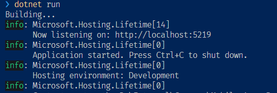
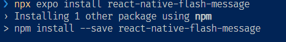

# Mobile project

## 1. Git repo

Use instruction in [Api project](../4.%20Project/Api%20Project.md#git-repo) to create a new repo for the mobile app.

## 2. Download and update the template

- Form moodle, download `RoiFrontend Expo app` in your directory and extract it.
- Copy the template contents to your new repo created for mobile app.
- **Delete** `package-lock.json` file
- Update `package.json` by removing `dependencies` part, and add the new `dependencies` form the following:

```javascript
  "dependencies": {
    "@expo/vector-icons": "^13.0.0",
    "@expo/webpack-config": "^19.0.0",
    "@react-native-async-storage/async-storage": "1.18.2",
    "@react-native-community/netinfo": "9.3.10",
    "@react-navigation/bottom-tabs": "^6.5.11",
    "@react-navigation/native": "^6.1.9",
    "@react-navigation/native-stack": "^6.9.17",
    "expo": "~49.0.15",
    "expo-linking": "~5.0.2",
    "expo-status-bar": "~1.6.0",
    "moment": "^2.29.4",
    "react": "18.2.0",
    "react-dom": "18.2.0",
    "react-native": "0.72.6",
    "react-native-safe-area-context": "4.6.3",
    "react-native-screens": "~3.22.0",
    "react-native-web": "~0.19.6",
    "@react-native-picker/picker": "2.4.10"
  },
```

- Run the command `npm install` to install new packages
- You can start the app using `npm start`
- You will encounter the following errors:

```python
ERROR in ./navigation/PeopleNavigator.js:1
Module not found: Can't resolve '@react-navigation/stack'
> 1 | import { createStackNavigator } from '@react-navigation/stack';
  2 | import * as React from 'react';
  3 |
  4 | // Import navigation and screens

ERROR in ./navigation/RootNavigator.js:1
Module not found: Can't resolve '@react-navigation/stack'
> 1 | import { createStackNavigator } from '@react-navigation/stack';
  2 | import * as React from 'react';
  3 |
  4 | // Import navigation and screens

web compiled with 2 errors
```

- Update `./navigation/RootNavigator.js`
- Line 1 and 13

```javascript
// import { createStackNavigator } from '@react-navigation/stack';
import { createNativeStackNavigator } from '@react-navigation/native-stack';

// const Stack = createStackNavigator();
const Stack = createNativeStackNavigator();
```

- Update `./navigation/PeopleNavigator.js`
- Line 1 and 10

```javascript
// import { createStackNavigator } from '@react-navigation/stack';
import { createNativeStackNavigator } from '@react-navigation/native-stack';

// const Stack = createStackNavigator();
const Stack = createNativeStackNavigator();
```

- Now the template is updated to the latest version. And working fine

## 3. Connect with the Api

- Start your **Api project**, and record the url



- Download files in `utils` folder in this repo
- Copy downloaded files into `utils` folder in your project (**replace**)
- Comment `const apiUrl = "https://localhost:7215/api/v1";` in `Api.js`
- Update `apiUrl` to match your server in `RoiApi.js`, use http instead of https, note the port no is different

```javascript
const apiUrl = 'http://localhost:5219/api';
```

- In `ViewPeopleScreen` update

```javascript
// import { RoiGetPeople } from '../utils/Api';
import { RoiGetPeople } from '../utils/RoiApi';
```

- Start your app using `npm start` or `npx expo start`
- You should see list oe people in the view people screen

## 4. Update files and styles

- Install the following package

```bash
npx expo install react-native-flash-message
```



- Copy files form folders `components`, `constants`, `styles`, and `App.js` and `jsconfig.json`
- Run your app to see different coloring style

## 5. Update Home Screen

- Add Buttons
- Add Logo Image
- Add App Name
- Add click functionality to logo image

## 6. Update Help Screen

```javascript
  // State management

  const [fontSizeModifier, setFontSizeModifier] = React.useState(Settings.fontSizeModifier);

  // changeFontSize(-0.1)
  function changeFontSize(sizeModifier) {

    // TODO: validate the font size (e.g. not negative)

    // Update the global settings value
    Settings.fontSizeModifier += sizeModifier;

    // Update the state variable to re-render the screen (update the UI)
    setFontSizeModifier(Settings.fontSizeModifier);
  }
```

## 7. ViewPeople Screen

```javascript
  function showAddPerson() {
    // Navigate to AddPerson and replace the current screen
    props.navigation.replace('Root', { screen: 'AddPerson' });
  }

  function showViewPerson(person) {
    // Navigate to ViewPerson and pass through the person's ID as a param
    props.navigation.navigate('ViewPerson', { id: person.id });
  }

  function showEditPerson(person) {
    // Navigate to EditPerson and pass through the person's ID as a param
    props.navigation.navigate('EditPerson', { id: person.id });
  }

  /**
   * Delete a person from the database
   * @param {Person} person The person to delete.
   */
  function deletePerson(person) {
    // Check if person should be deleted (confirm with user)
    PopupOkCancel(
      // Title and message
      'Delete person?',
      `Are you sure you want to delete ${person.name}`,

      // 0K - delete the person
      () => {
        // Delete the person using the API
        RoiDeletePerson(person.id)
          .then((data) => {
            // Show confirmation that the person has been deleted
            PopupOk('Person deleted', `${person.name} has been  deleted`);
            // Refresh the person list
            refreshPersonList();
          })
          .catch((error) => {
            // Display error
            PopupOk('API Error', 'Could not delete person');
          });
        // console.log('Ok.. deleting person');
      },
      // Cancel do nothing
      () => {
        console.log('Cancel - no delete for you!');
      }
    );
  }

  // Display flash message banner if offline
  function displayConnectionMessage() {
    console.log('displayConnectionMessage');
    // Get network connection status
    NetInfo.fetch().then((status) => {
      // Check if not connected to the Internet
      if (!status.isConnected) {
        // Display the flash message
        infoMessage('No internet connection', 'You will only see cached data until you \nhave an active internet connection again');
      }
    });
  }
```

## 8. AddPersonScreen

- Download `AddPersonScreen.js` from screens folder into screens folder
- Add the following to `BottomTabNavigator.js` from navigation folder

```javascript
import AddPersonScreen from '../screens/AddPersonScreen';
```

- Add the following between People and help `BottomTab.Screen`

```jsx
      <BottomTab.Screen
        name="AddPerson"
        component={AddPersonScreen}
        options={{
          title: 'Add Person',
          tabBarIcon: ({ focused }) => <TabBarIcon focused={focused} name="md-person-add" />,
        }}
      />
```

## 9. EditPersonScreen

- Download `EditPersonScreen.js` from screens folder into screens folder

## 10. ViewPersonScreen

- Download `ViewPersonScreen.js` from screens folder into screens folder
