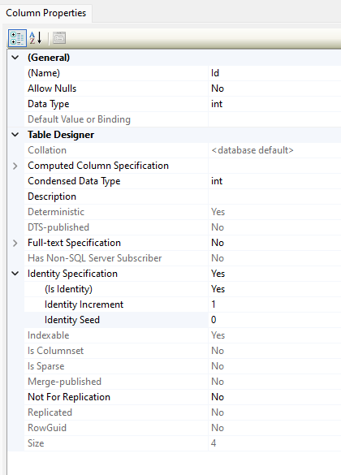

# Sql Server

**SQL Server** is a relational database management system (RDBMS) developed by Microsoft. It is a software application that manages the storage, retrieval, and manipulation of data in a relational database. SQL Server supports the Structured Query Language (SQL) for interacting with the database. It is widely used for various data storage and management tasks in enterprise and application development.

## SQL Server Instance

In SQL Server, an instance is a separate and isolated installation of the SQL Server software on a computer or server. Each SQL Server instance has its own system databases, configuration settings, and security. Multiple instances of SQL Server can coexist on the same physical server, each serving different databases or applications. Instances are used to isolate and manage different sets of databases and configurations.

## SQL Server Server

In the context of SQL Server, a server typically refers to the physical or virtual machine on which SQL Server is installed. It is the hardware or virtual environment that hosts one or more SQL Server instances. A server can be a physical server, a cloud-based virtual machine, or any other computing environment capable of running SQL Server.

## SQL Server Express LocalDB

LocalDB is a lightweight version of the SQL Server Database Engine that starts and stops automatically and is intended for single-user scenarios.

The `(LocalDb)` part of the name specifies that the instance is running on the local machine, and `MSSQLLocalDB` is the name of the instance 1

### install SQL Server Express LocalDB

SQL Server Express LocalDB designed for developers and is often used in application development and testing scenarios. You can install SQL Server Express LocalDB using different methods:

#### SQL Server Express LocalDB Installer (MSI)

You can download the SQL Server Express LocalDB installer (MSI) from the Microsoft website

#### Install via Visual Studio

SQL Server Express LocalDB can also be installed through Visual Studio as part of the development environment.

## Create Foreign Key Using SSMS GUI

- To create a Foreign Key using the SSMS, using Object Explorer select the referencing table `dbo.Person`, go to Keys, right click on Keys and select New Foreign Key
- The table designer will open as well as a new window like below.
- Click on the ellipse (`...`) next to **Tables and Columns Specification**.
- Another window will open like below.
- Change the Relationship Name (Foreign Key name) and also need to select the appropriate tables and columns
- Save

- Set primary key

- Set the identity

- You should see the following

